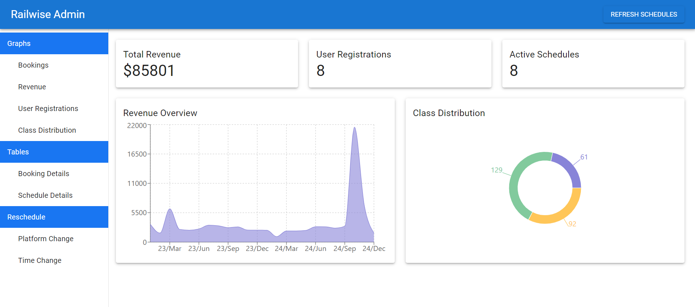

# RailWise - Train Booking System (Admin Frontend)



## Overview

RailWise Admin Frontend is the administrative panel of the RailWise Train Booking System, designed to enable administrators to manage train schedules, monitor bookings, handle cancellations, and generate analytical reports. Built using **Vite + React**, the admin dashboard offers a clean and efficient interface for managing train operations and overseeing system performance.

## Features

- **Train Schedule Management**: Admins can add, update, and delete train schedules.
- **Booking Monitoring**: View and manage bookings made by passengers.
- **Seat Management**: Track seat availability and occupancy for different classes.
- **User Management**: Manage registered passengers and administrators.
- **Reports and Analytics**: Generate booking trends, revenue reports, and system performance analytics.
- **Secure Authentication**: Admins are authenticated with secure login systems.

## Tech Stack

- **Frontend**: Vite, React, Tailwind CSS
- **Backend**: Node.js, Express (Separate Repository)
- **Database**: MongoDB

## Installation and Setup

To get a copy of the admin panel up and running on your local machine, follow these steps:

### Prerequisites

- **Node.js** (v14 or higher)
- **NPM** (v6 or higher) or **Yarn**
- **Vite** (for development)

### Clone the Repository

```bash
git clone https://github.com/EmyysJanaK/Railwise-Admin-Frontend.git
cd Railwise-Admin-Frontend
```

### Install Dependencies

```bash
npm install
```

or

```bash
yarn install
```

### Environment Variables

Create a `.env` file in the project root and add the following environment variables:

```bash
VITE_BACKEND_URL=<BACKEND_API_URL>
```

### Running the Application

To start the development server, use:

```bash
npm run dev
```

or

```bash
yarn dev
```

### Building for Production

To build the application for production, run:

```bash
npm run build
```

or

```bash
yarn build
```

This will generate the static files in the `dist` folder, which can be deployed to any static hosting service.

### Running Unit Tests

We use **Vitest** for unit testing. To run tests:

```bash
npm run test
```

or

```bash
yarn test
```

## Folder Structure

```bash
├── src
│   ├── assets              # Static assets (images, fonts)
│   ├── components          # Reusable components
│   ├── context             # React context providers
│   ├── hooks               # Custom hooks
│   ├── pages               # Application pages
│   ├── utils               # Utility functions
│   ├── App.jsx             # Main app component
│   └── main.jsx            # Application entry pointpoint
├── public                  # Public files
├── .env                    # Environment variables
├── vite.config.js          # Vite configuration
└── package.json            # Project dependencies and scripts
```

## Key Components

- **Dashboard**: Admin overview with quick stats on bookings, revenue, and train schedules.
- **Train Management**: Allows admins to manage train routes, schedules, and seat allocations.
- **Booking Management**: View all active and past bookings, with options to modify or cancel.
- **User Management**: Manage the list of registered passengers and administrators.

## Contributions

The project is maintained by:

- **Sarathchandra D.M.P.M. (210577K)** - Project Scope, Need for the Project
- **Senaratne R.R.S.N. (210592C)** - Deliverables, Overview of Existing Systems and Technology
- **Senevirathne R.J.M. (210598B)** - Project Overview, Objectives
